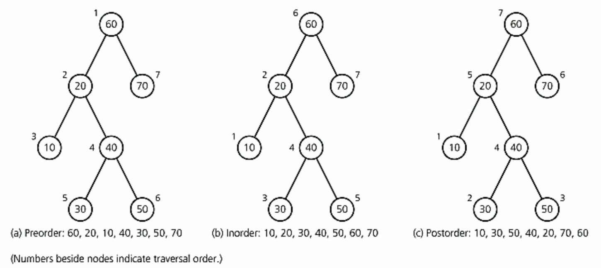

# Assignment 3: Binary Search Tree (BST)

In this assignment, you will be creating a binary search tree (BST). The tree will be storing words ( Strings ), which you will insert, as well as delete, recursively. You will also be implementing tree traversals, which are different orders in which you recursively visit the items in a tree.

## Testing

* Testing can be done through Maven with the command,  
  `mvn test`  
* To run more specific tests, run the command  
  `mvn -Dtest=BinarySearchTree#TESTCASEHERE test`  
  where `TESTCASEHERE` is the test case you want to run. These test cases can be found in **src/test/java/BinarySearchTreeTest**  
  * For example,  `mvn -Dtest=BinarySearchTree#test_put test` tests your put method.

The results can be found in the command line or in **target/surefire-reports/BinarySearchTreeTest.txt** after execution.

**Part of grading will be these test cases.**

Alternatively,

To test your BST, the main() in TestBST.java creates an instance of your BST and tests it. It makes use of the printTreeStructure() method that we've provided on BinarySearchTree . This prints out the internal structure of the tree so you can verify your operations are behaving correctly.

## Implementing a BST

You will be creating a BST using a BST class called BinarySearchTree . It implements the interface BSTInterface . BSTNodes will be used to store an item  which in this assignment are Strings . It will also contain references to its left and right subtrees (which as also BSTNodes ). The BSTNode constructor will initialize the item to a value and the left and right nodes to null .

The BinarySearchTree class itself only has one field, the root of the BST. The constructor for the BinarySearchTree only has to set the root to null . We will be using MyQueue to store elements from traversals. That is, instead of preorder, inorder and postorder traversals printing out the elements of the tree, they will each return a MyQueue containing the elements in that order. The MyQueue class and methods will be provided for you, but you may feel free to use your own.

## You will be implementing the following methods for your BST:

* public boolean isEmpty ()
    * Returns true if BST is empty, false otherwise
* public void makeEmpty ()
    * Clears BST so that it is empty
* public MyQueue inOrder ()
    * Returns a queue with the elements in-order
* public MyQueue preOrder ()
    * Returns a queue with the elements in pre-order
* public MyQueue postOrder ()
    * Returns a queue with the elements in post-order
* public boolean contains (String s)
    * Returns true if the BST contains the string, otherwise returns false
* public void put (String s)
    * If the string is already in the BST, then put will do nothing. If the string is not in the BST, then put will add the string to the BST.
* public void delete (String s)
    * Removes the specified string from the BST, if the string cannot be found, then delete does nothing

## Implementing public void put (String s)
Implementing put( String s ) will require creating a recursive helper method to assist with searching through the BST to find the appropriate place to put the new node. In your put ( String s) method, you will need to call recursiveInsert() with the root
of your BST as one argument and the String to insert as the other. Set root equal to the node returned from recursiveInsert() . The way to think about this is that you're
setting the root equal to the new tree that results from doing the recursive insert.

## Implementing protected BSTNode recursiveInsert (BSTNode node, String s)
* You will have two cases to consider: 1) if node is null or 2) when node is not null.
* When node is null , this means that you've come to an empty subtree. This is where you will create the new node. Return a new BSTNode containing the String.
* If node is not null , then you need to compare the String argument to the item in the node.
    * If the String s is alphabetically before node.item , then we want to set the left subtree of node ( node.left ) equal to recursively inserting s into the left subtree.
    * Similarly, if the String s is alphabetically after node.item , then we want to set the right subtree of node ( node.right ) equal to recursively inserting s into the right subtree. In both these cases the recursive call continues searching down the tree looking for the appropriately place to do an insert.
    * If String s is equal to node.item , we don't need to do anything. This means the String is already in the BST. In fact, we don't even have to explicitly test for this case since we're not going to do anything other than return the node.

* Return the node . The way to think about this is that you're returning the subtree rooted at node into which you've inserted the String.

## Implementing public boolean contains (String s)
This method allows you to search through the BST for a specified string, String s . It will return true if the string is stored within the BST, false otherwise. All the work is done by the recursive helper function, recursiveSearch() . All that contains()
does is return the result of calling recursiveSearch() with the root and the String as arguments.

## Implementing protected boolean recursiveSearch (BSTNode node, String s)
This helper function searches the subtree rooted at node for the String s , returning true if it finds it, false otherwise.
* If node is null we haven't found the String . Return false .
* If the item stored in node is equal to s , we've found the string. Return true .
* If String s is alphabetically before node.item , return the result of recursively searching the left subtree of node .
* If String s is alphabetically after node.item , return the result of recursively searching the right subtree of node .

## Implementing public void delete (String s)
This method searches for String s and deletes the node in the BST containing it. If it does not find the specified string, then the method will do nothing.

Implementation of delete( String s) will require the assistance of three helper functions.
* protected BSTNode recursiveRemove (BSTNode node, String s) - given a subtree rooted at node and a String s , returns the node that is the root of the new subtree that results from removing s from the subtree.
* protected BSTNode deleteNode (BSTNode node) - given a node to remove, returns the new subtree that results from removing that node. This is the method that handles the four cases for deleting nodes: leaf nodes (no children), just a left child, just a right child, and two children (the most complicated case).
* protected String getSmallest (BSTNode node) - returns the alphabetically smallest (first in alphabetical order) String in the subtree whose root is the node argument.

All delete() does is set the root equal to the result of calling recursiveRemove() with the root and string as arguments.

## Implementing protected Node recursiveRemove (BSTNode node, String s)
This function is somewhat similar to the recursive helper functions for put(). If the node is not equal to null , then we need to compare node.item with the string.
* If the String s is alphabetically before node.item , then we want to set the left subtree of node ( node.left ) equal to recursively removing s from the left subtree.
* If the String s is alphabetically after node.item , then we want to set the right subtree of node ( node.right ) equal to recursively removing s from the right subtree.
* If String s equals node.item , we want to set the node equal to the result of calling deleteNode() . This can be thought of as setting node equal to the new subtree that results when you delete the root of this subtree.
* If the node is null that means that we never found the string and there's nothing we have to do. So we don't even have to explicitly test for this case. We just need to skip over the tests above if the node is null (which is why there's first a test to make sure it isn't null ).
* Return the node . This is the modified subtree after removing the string (or null if the node is null).

## Implementing protected BSTNode deleteNode (BSTNode node)
deleteNode() handles the four cases of removing a node.
* Case 1: No children. If both the left and right children are null this means it is a leaf node and we can just remove it. Set node equal to null.
* Case 2: Just a left child. If there's only a left child, then set node equal to node.left . The one child is "promoted" into being the root of the subtree.
* Case 3: Just a right child. If there's only a right child, then set node equal to node.right . The one child is "promoted" into being the root of the subtree.
* Case 4: Two children. With two children we have to do something more complicated to rearrange the subtree.
    * Call getSmallest() on the subtree node.right to get the in-order successor. This is the smallest value that is larger than the current node.item (the next item in alphabetical order stored in the tree).
    * Set node.item equal to this in-order successor. The left and right child relationships will still hold: everything to the left will still be alphabetically before the new item and everything to the right will still be alphabetically after the new item (since the new item is the smallest value from the right subtree).
    * Set node.right equal to recursively removing the in-order successor from the right subtree. Since you've moved this value into the current node, you can now delete the value from the right subtree. When recursiveRemove() ends up calling deleteNode() again, the in-order successor is guaranteed to be one of the "easy" cases (0 or 1 child).
* Return node .

## Implementing protected String getSmallest (BSTNode node)
To start the process for finding the smallest string in the subtree rooted at node , define a String variable smallest and set it equal to node.item.

Now we'll keep on following left branches in the tree (since things to the left are always smaller values), until we can't go left any more. Then we know we've found the smallest value.
* While node.left is not null
    * Set smallest equal to node.left.item.
    * Set node equal to node.left.
    * Return smallest.

## Traversing BSTs (Optional)

In this portion of the assignment, you will be implementing these methods, which enable you to traverse through your BST:

public MyQueue inOrder () : Does an in-order traversal to return a queue of strings in-order. This is the strings in alphabetical order.

public MyQueue preOrder () : Does a pre-order traversal to return a queue of strings pre-order. This is the order in which you'd want to insert the strings into a new tree to replicate the tree structure.

public MyQueue postOrder () : Does a post-order traversal to return a queue of strings post-order. This is the order of strings from the leaves upward, starting from the left and going rightward.

For examples of how these traversals work and further information, you may visit the following links:

https://www.youtube.com/watch?v=gm8DUJJhmY4

https://www.youtube.com/watch?v=5dySuyZf9Qg

https://www.tutorialspoint.com/data_structures_algorithms/tree_traversal.htm

Each of the functions has a recursive helper function:
* void inOrderRecursive (BSTNode node, MyQueue queue)
* void preOrderRecursive (BSTNode node, MyQueue queue)
* void postOrderRecursive (BSTNode node, MyQueue queue)

### Implementing public MyQueue inOrder ()
* Create a new MyQueue .
* Call inOrderRecursive() with the root and the new MyQueue as arguments.
* Return the MyQueue .

### Implementing preOrder() and postOrder()
Follow the same pattern.

## Implementing protected void inOrderRecursive (BSTNode node,MyQueue queue)
If the node is not null
* Recursively call inOrderRecursive() on the left subtree.
* Add node.item to the queue.
* Recursively call inOrderRecursive() on the right subtree.

Each of the other recursive helpers follow the same pattern. For pre-order, you add to the queue first, then recursively process the left and right subtrees, while for post-order you recursively process the left and right subtrees first, then add the current node.item to the queue at the end.
